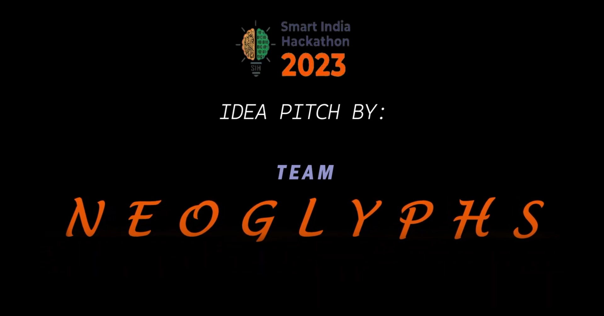

# 🧾 Blockchain-Based Certificate Management System

A secure, decentralized platform for issuing, storing, and verifying digital certificates using blockchain and IPFS, developed as part of **Smart India Hackathon 2023**.

## 🚀 Overview

In today’s world, where digital credentials are crucial for education and professional growth, ensuring their authenticity, security, and ease of verification is more important than ever. This project provides a robust solution using blockchain and IPFS to manage certificates in a transparent, tamper-proof, and user-friendly way.

## 🎯 Key Features

- 🔒 **Immutable and Timestamped Certificates**  
  Every certificate is hashed and stored with its metadata, ensuring it cannot be tampered with once issued.

- 📦 **IPFS-Powered Decentralized Storage**  
  Certificate data is stored and retrieved using IPFS for distributed, fault-tolerant access.

- 📜 **Smart Contracts for Verification**  
  Solidity smart contracts ensure reliable on-chain hash comparisons for validating certificate authenticity.

- 📱 **QR Code Verification**  
  Each certificate includes a QR code linking to a multilingual verification page for real-time validation.

- 🗂 **Digital Locker for Users**  
  Users access and manage all their certificates via a secure and intuitive dashboard.

- 🔔 **Notifications for New Certificates**  
  Users receive alerts when new certificates are issued, ensuring timely access to their credentials.

- 🌐 **Multilingual Support**  
  Verification pages are available in multiple languages, making the platform accessible to a wider audience.

- 🌙 **Dark Mode & UX Enhancements**  
  Features like dark mode improve user experience and visual comfort.

## 🧩 Repository Structure

The repository is organized into multiple branches based on functionality:

- `fabric` – Work related to private blockchain using **Hyperledger Fabric**
- `ipfs-storage` – Code for storing and retrieving certificate data on **IPFS**
- `smart-contracts` – **Solidity contracts** for certificate hash comparison and validation

> 📦 The frontend is maintained in a separate repository.

## 🛠️ Tech Stack

- **Blockchain**: Solidity, Ethereum-compatible public blockchain
- **Storage**: IPFS (InterPlanetary File System)
- **Smart Contracts**: Solidity
- **Other Tools**: Web3.js / Ethers.js, Node.js (for backend integration)

## 👥 Built For

- 🎓 Students & Educational Institutions  
- 🏢 Industries & Recruiters  
- 🏛️ Government & Certification Bodies

## 📄 License

This project is licensed under the [MIT License](LICENSE).

## 🙌 Acknowledgements

- Developed as part of **Smart India Hackathon 2023**
- Thanks to mentors, team members, and all contributors

---
